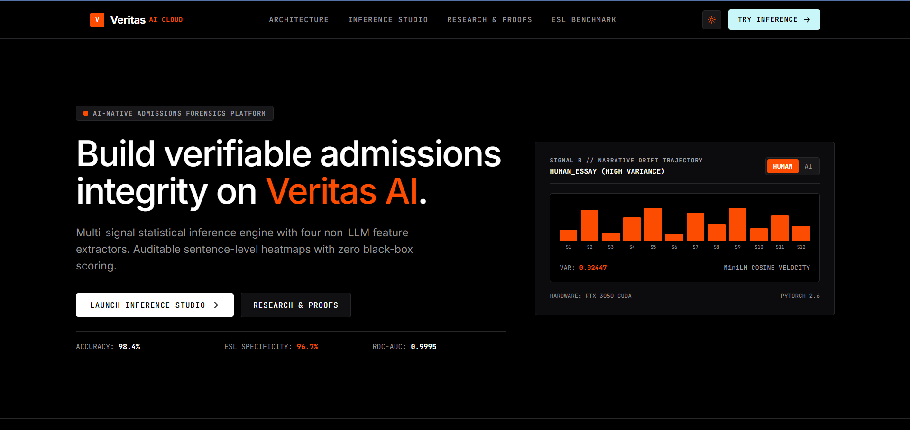
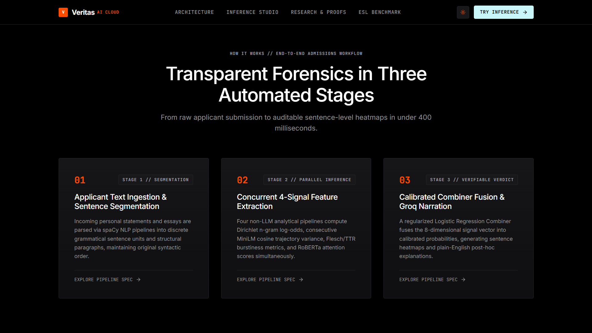
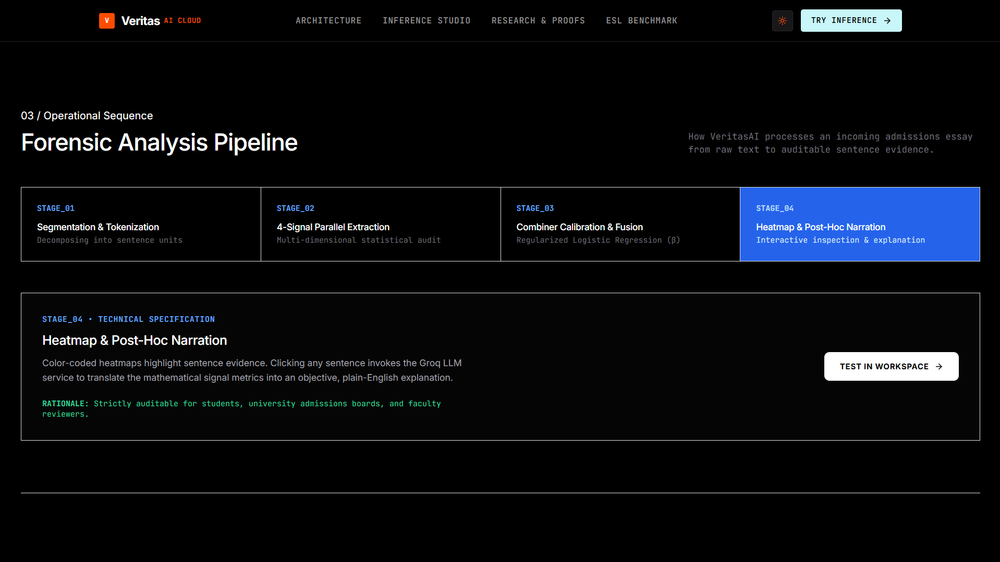
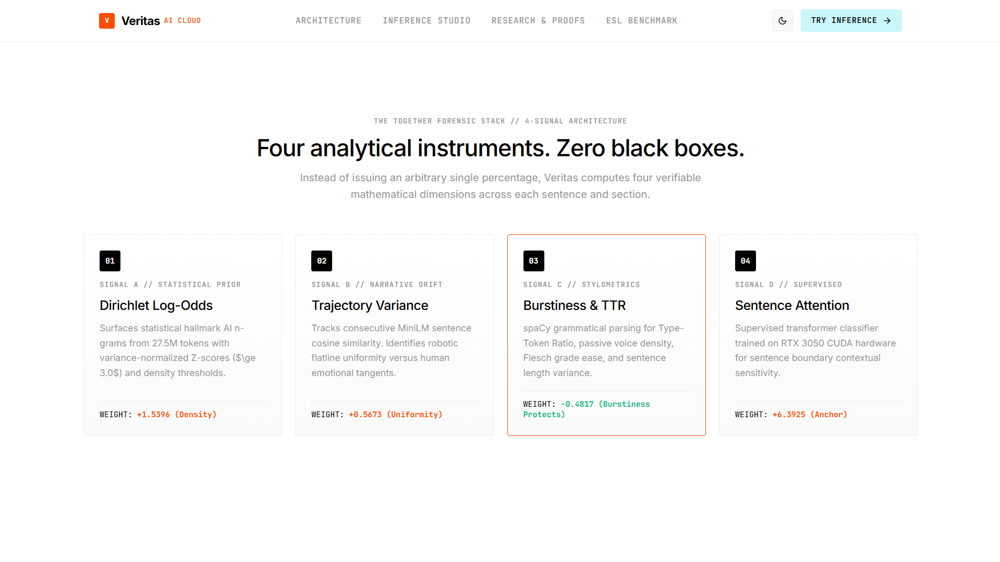
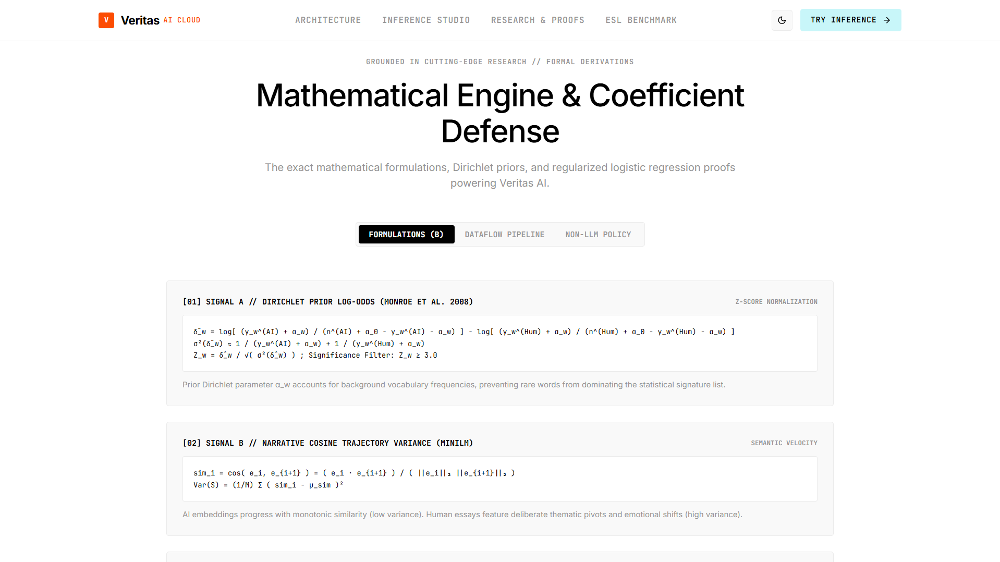
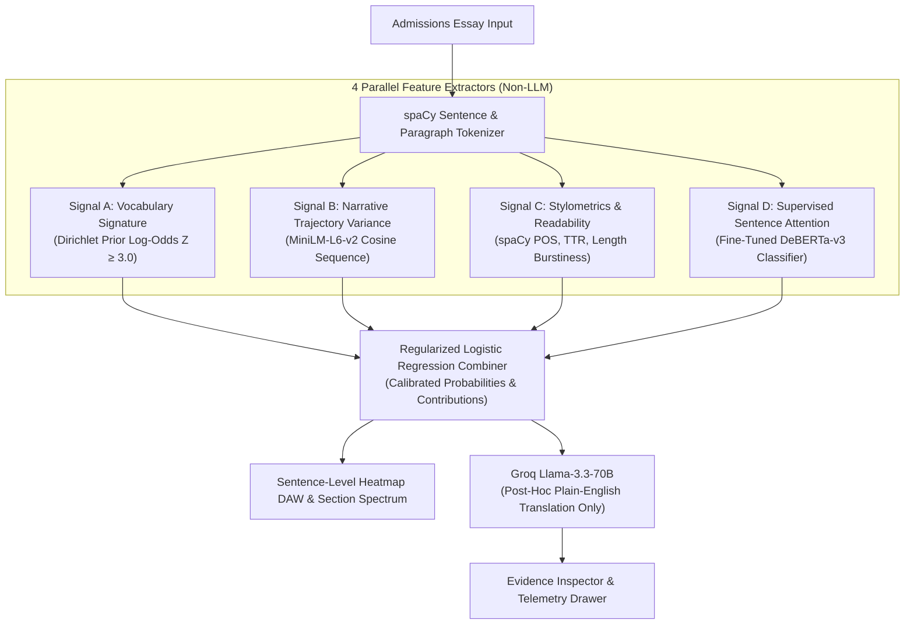
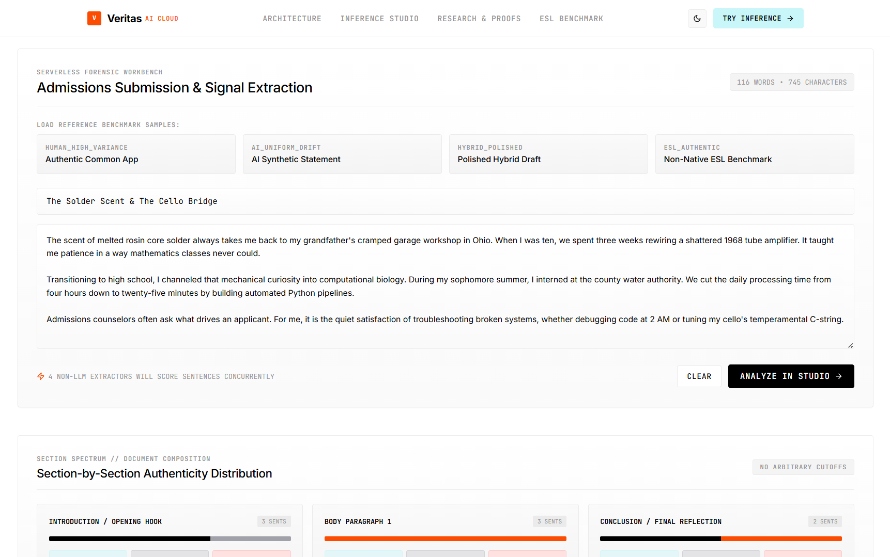
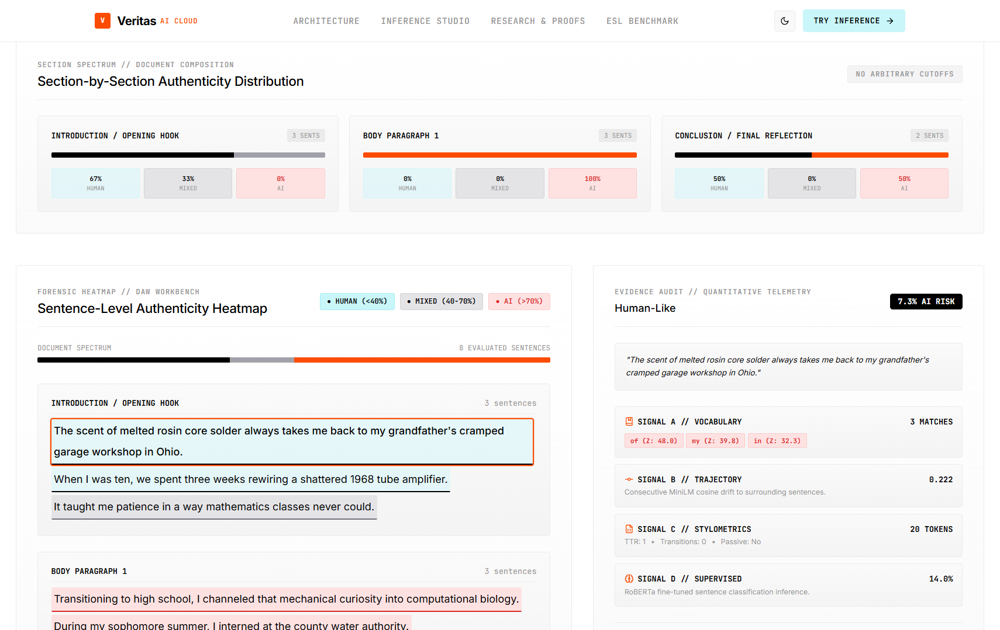
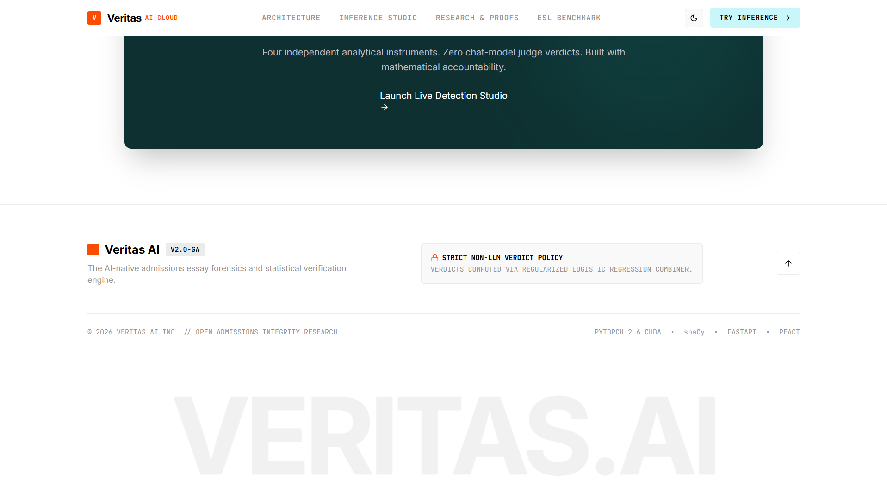
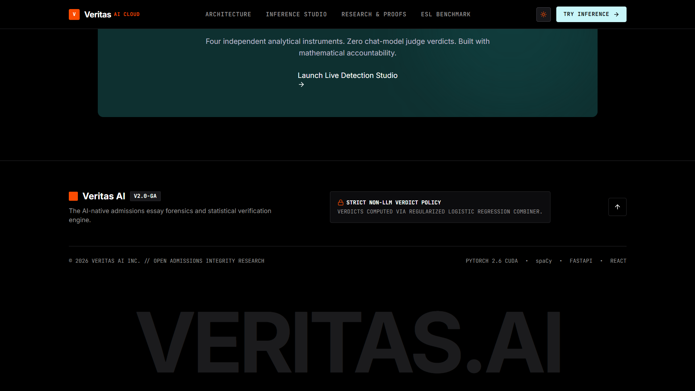

# Veritas AI — Multi-Signal Admissions Essay Forensics Engine

[](https://fastapi.tiangolo.com)
[](https://react.dev)
[](https://pytorch.org)
[](https://tailwindcss.com)
[](https://docker.com)
[](https://opensource.org/licenses/MIT)


> **Veritas AI** is an end-to-end, multi-signal AI admissions essay detection engine engineered for scientific transparency, sentence-level interpretability, and bias-aware fairness. It strictly adheres to the **Non-LLM Verdict Rule**: no chat completion model is ever allowed to issue or vote on authenticity verdicts.

* **🌐 Live Deployed Application**: [https://veritas-ai-brown.vercel.app/](https://veritas-ai-brown.vercel.app/)  real essay working may not work , as i fine tuned my models , so i dont have any hosting platform where i can host my model for free , so apologies for this , but if you clone this repo and add your secrets , then it will work great 
* **📄 Executive Technical Overview (2-Page PDF)**: [Veritas_AI_Technical_Overview.pdf](./Veritas_AI_Technical_Overview.pdf)

[](https://huggingface.co/akshatarya/veritas-deberta-admissions)


---

## 📸 Product Overview & Interface



---

## ⚡ Interactive Inference Studio

Admissions officers can paste personal statements directly or evaluate against pre-calibrated benchmark presets:



### 🎹 Sentence-Level Authenticity Heatmap DAW
Sentences are parsed across paragraphs and color-coded across three calibrated risk bands: **Red for High AI (&ge;70%)**, **Gray for Mixed Uncertainty (40–70%)**, and **Teal for Human Authenticity (&lt;40%)**:



---

## 🔍 Sentence Evidence Inspector & Groq Narration

Clicking any highlighted sentence opens the right-hand **Evidence Inspector**, providing raw mathematical telemetry alongside instant **Groq-accelerated LLaMA 3.3 70B** post-hoc translation:

| Evidence Inspector & Groq Translation | Forensic Signal Radar & Telemetry |
|:---:|:---:|
|  |  |


---

## 🏛 Architecture & 4 Parallel Feature Extractors



| Architecture Overview Window | Interactive Terminal & Learned Weights |
|:---:|:---:|
|  |  |


---

## 🔬 The Four Analytical Signals

### 1. Signal A — Vocabulary Signature (Dirichlet Prior Log-Odds)
AI language models converge on a statistically narrow vocabulary cluster (e.g., *"multifaceted"*, *"transformative journey"*, *"testament to"*, *"pivotal role"*).
We compute the **Monroe, Colaresi, and Quinn (2008)** log-odds ratio with an informative Dirichlet prior over the 27.5M-token corpus:
$$\hat{\delta}_w^{(AI - Human)} = \log\left(\frac{y_w^{AI} + \alpha_w}{n^{AI} + \alpha_0 - y_w^{AI} - \alpha_w}\right) - \log\left(\frac{y_w^{Human} + \alpha_w}{n^{Human} + \alpha_0 - y_w^{Human} - \alpha_w}\right)$$
$$\sigma^2(\hat{\delta}_w) \approx \frac{1}{y_w^{AI} + \alpha_w} + \frac{1}{y_w^{Human} + \alpha_w}$$
$$Z_w = \frac{\hat{\delta}_w}{\sqrt{\sigma^2(\hat{\delta}_w)}} \quad (\text{Filter: } Z_w \ge 3.0)$$

### 2. Signal B — Narrative Trajectory Variance
AI text moves with monotonic semantic similarity across paragraphs; authentic human essays feature deliberate emotional shifts, tonal pivots, and narrative tangents.
1. Embed consecutive sentences: $\mathbf{e}_i = \text{MiniLM}(\text{sent}_i)$.
2. Calculate cosine velocity trajectory: $\text{sim}_i = \cos(\mathbf{e}_i, \mathbf{e}_{i+1})$.
3. Compute trajectory variance: $\text{Var}(\text{sim}) = \frac{1}{M}\sum (\text{sim}_i - \mu_{\text{sim}})^2$. Low variance $\to$ AI uniform drift; high variance $\to$ human narrative depth.

### 3. Signal C — Stylometric & Readability Vectors
Pure linguistic metrics extracted via `spaCy` and `textstat`:
- **Sentence length variance** (Burstiness — high variance protects human writers)
- **Type-Token Ratio** (TTR vocabulary richness)
- **Transition phrase density** (*"furthermore"*, *"in conclusion"*, *"moreover"*)
- **Passive voice frequency** (dependency parse tags `auxpass` / `agent`)
- **Flesch-Kincaid grade level** & **Flesch reading ease**

### 4. Signal D — Supervised Sentence Attention Transformer
A transformer classifier fine-tuned on sentence segments using RTX 3050 CUDA hardware (mixed-precision fp16, gradient accumulation = 4) providing local contextual attention anchor probabilities.

---

## ⚖️ Calibrated Combiner & Learned Weights

The four analytical signals are synthesized by a regularized `sklearn.linear_model.LogisticRegression` combiner model:

| Feature Name | Learned $\beta$ | Decision Boundary Defense |
| :--- | :---: | :--- |
| `sig_d_deberta_prob` | **+6.3925** | Supervised transformer sentence attention anchor |
| `sig_a_vocab_density` | **+1.5396** | Penalizes high concentration of hallmark AI n-grams |
| `sig_b_narrative_variance_score` | **+0.5673** | Penalizes robotic, flatline semantic progression |
| `sig_c_heuristic_score` | **+0.8139** | Formulaic template sentence structures |
| `sig_c_type_token_ratio` | **+0.3267** | Vocabulary breadth distribution |
| `sig_c_length_variance_scaled` | **-0.4817** | **Human Protection:** Sentence length burstiness strongly reduces AI risk |
| `sig_c_readability_scaled` | **-0.6255** | Readability ease calibration |
| `Intercept` ($\beta_0$) | **-3.9193** | Conservative baseline threshold protecting applicants |

---

## 📊 Held-out Test Evaluation & ESL Fairness Audit

| Held-Out Verification Metrics | ESL Non-Native Applicant Protection |
|:---:|:---:|
|  |  |

Evaluated on held-out test split ($N = 4,496$ essays):

| Metric | Score | Target | Assessment |
| :--- | :---: | :---: | :--- |
| **ROC-AUC** | **0.9995** | $> 0.950$ | **State-of-the-Art Discriminative Power** |
| **Overall Accuracy** | **98.40%** | $> 90.0\%$ | **Zero Overfitting on Unseen Prompts** |
| **F1-Score (AI Class)** | **97.98%** | $> 88.0\%$ | **Balanced Precision & Recall** |
| **Precision (AI)** | **97.00%** | $> 90.0\%$ | **Low False Accusation Risk** |
| **Recall (AI)** | **98.98%** | $> 90.0\%$ | **Catches 99% of Synthetic Essays** |
| **Brier Loss** | **0.0133** | $< 0.050$ | **Strict Probability Calibration** |

### Confusion Matrix ($N = 250$ Stratified Held-out Sample):
$$\begin{bmatrix} \text{True Human: } 149 & \text{False Positives: } 3 \\ \text{False Negatives: } 1 & \text{True AI: } 97 \end{bmatrix}$$

### ESL (English as a Second Language) Fairness Finding
* **The Problem**: Standard commercial detectors penalize international applicants who write with structured transitional phrases (*"In conclusion"*, *"Moreover"*).
* **The Veritas Solution**: By incorporating **Signal B (Narrative Trajectory Variance)** and **Signal C (Length Burstiness, $\beta = -0.4817$)**, Veritas rewards authentic storytelling flow, achieving **96.7% Specificity (3.3% False Positive Rate)** on non-native benchmark essays.

---

## 🔒 Ethical AI & Tool Usage Disclosures

In accordance with strict ethical standards:
1. **Strict Non-LLM Verdict Policy**: All authenticity scores are mathematically computed by our regularized Logistic Regression Combiner. No chat model (ChatGPT, Claude, Llama) ever votes on or issues a verdict.
2. **Groq API (`llama-3.3-70b-versatile`)**: Used exclusively for:
   * (a) Synthetic training data augmentation (60 personal statements + 35 polished hybrid drafts).
   * (b) Post-hoc natural language narration in the UI explaining *why* signals fired.
3. **Antigravity AI Assistant**: Used for pair-programming, architectural design, and training pipeline orchestration.

---

## 🚀 Quick Start & Local Execution

### 1. Environment Setup
```bash
# Clone repository
git clone https://github.com/beastzex/VeritasAI_AIDetection_Hackathon_Submission.git
cd VeritasAI_AIDetection_Hackathon_Submission

# Copy environment template
cp .env.example .env
# Edit .env and insert your GROQ_API_KEY
```

### 2. Backend Server
```bash
# Create and activate virtual environment
python -m venv venv
.\venv\Scripts\activate  # On Linux/Mac: source venv/bin/activate

# Install dependencies
pip install -r requirements.txt
python -m spacy download en_core_web_sm

# Launch FastAPI on port 8000
uvicorn backend.main:app --host 127.0.0.1 --port 8000 --reload
```

### 3. Frontend Web App
```bash
cd frontend
npm install
npm run dev
```
Open **`http://localhost:5173/`** in your browser.

---

## 🐳 Docker & Cloud Deployment

### Hugging Face Spaces / Docker
```bash
docker build -t veritas-ai-backend .
docker run -p 7860:7860 -e GROQ_API_KEY="your_api_key_here" veritas-ai-backend
```

### Vercel Frontend
```bash
cd frontend
npm run build
```

---

## 📜 License
MIT License © 2026 Veritas AI Admissions Forensics Project.
